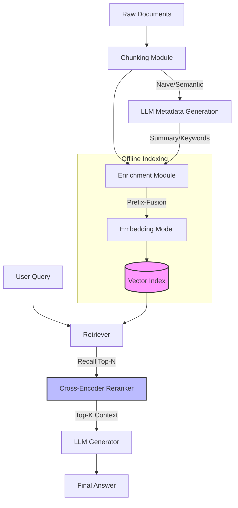
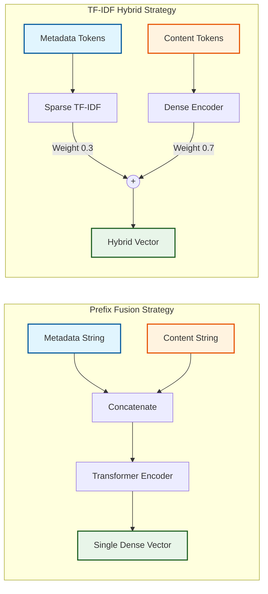
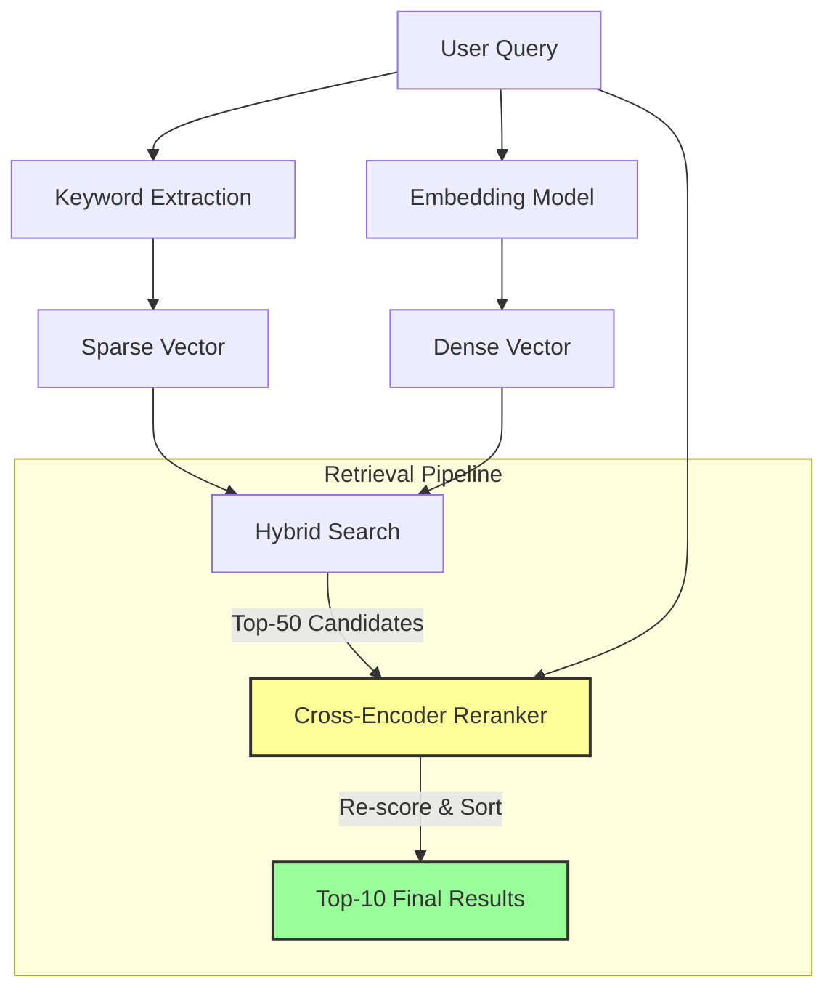

# Research Paper Diagram Designs

This document contains the finalized Mermaid diagrams for the framework's architecture and experimental design.

## Design 1: End-to-End Architecture

## Design 2: Embedding Construction Mechanisms

## Design 3: Retrieval & Reranking Workflow

